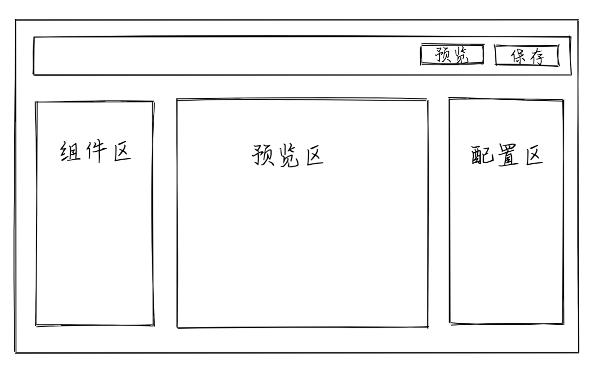

## 仿[有赞](https://account.youzan.com/)店铺的低代码平台开发
---
### 布局


---
### 功能
- 从组件区拖拽组件，拖拽到预览区域，
- 选中预览区域的组件可以在配置区进行样式配置
- 预览区域的组件可以进行拖拽排序
- 点击头部预览按钮可以进行预览
- 保存按钮保存数据
---
### 项目设计
- 参考有赞预览区设计，发现其内部使用的是iframe，预览区设计成单独的iframe的方式显示，这样的好处：方便预览,节省代码，不然要实现两边展示区的逻辑
- 项目分为两个系统，预览区iframe系统和编辑器系统
- 数据库采用浏览器的indexDB，配套的三方库采用[Dexie](https://dexie.org/)
- 项目难点：跨 iframe 拖拽，一些拖拽组件如react-dnd react-beautiful-dnd 都无法实现，参考了掘金上的一些文章，转转团队它们因react-dnd不支持跨iframe便放弃了，自己使用原生H5的拖拽事件封装一个。我的设计思路：数据驱动视图，可以在拖动时显示一个和iframe样式相同的盒子，来模拟iframe进行拖拽，因为在同一组件中并未设计到跨iframe并不会有任何问题，可以使用任何方式完成如react-dnd，只需拖拽结束后同步数据，传给iframe，iframe接收到数据后进行显示
- 跨 Iframe 通信，采用 postMessage 通信
----
### 组件区schema定义
```
{
  "name": "button",
  "compId": "Button",
  "description": "按钮组件",
  "icon": "",
  "config": [
    {
      "name": "bgcColor",
      "label": "按钮颜色",
      "type": "string",
      "format": "color"
    },
    {
      "name": "btnText",
      "label": "按钮文案",
      "type": "string",
      "format": "text"
    }
  ],
  "defaultConfig": { "btnText": "这是一个按钮", "bgcColor": "#333333" },
}
```
----
### 数据库设计